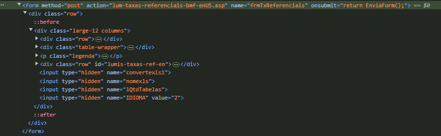

# Projeto: API de Taxas Referenciais

## Descrição
Este projeto cria uma API em Python usando Flask e BeautifulSoup que consulta dados de taxas referenciais do site da B3. O usuário pode fazer uma requisição GET especificando uma data e a taxa desejada, e o sistema retornará um JSON com as informações extraídas do site.
Para capturar corretamente esses dados, é necessário preencher um formulário nesta página e enviar as informações por meio de uma requisição POST.

## Pré-requisitos


## Instalação e Configuração

1. Clone o repositório:
   ```bash
   git clone https://github.com/AliePonzani/ProjetoB3_Taxas.git
   cd ProjetoB3_Taxas
   ```

2. Crie um ambiente virtual:
   ```bash
   python -m venv venv
   ```

3. Ative o ambiente virtual:
   - Windows:
     ```bash
     .\venv\Scripts\activate
     ```
   - MacOS/Linux:
     ```bash
     source venv/bin/activate
     ```

4. Instale as bibliotecas necessárias:
   ```bash
   pip install flask requests beautifulsoup4
   ```

5. Execute o servidor:
   ```bash
   python main.py
   ```
   O servidor estará disponível em `http://127.0.0.1:5000`.

## Como Usar

- Para fazer uma consulta, envie uma requisição GET para a rota `/slcTaxa` com os parâmetros:
  - `date`: A data no formato `DD/MM/AAAA`
  - `slcTaxa`: O tipo de taxa desejada (ex.: `PRE`)

  Exemplo:
  ```
  http://127.0.0.1:5000/slcTaxa?date=17/07/2024&slcTaxa=PRE
  ```

## Estrutura do Código

- **post_form(slcTaxa_request, date, date1)**: Função para enviar uma requisição POST ao site externo e retornar a tabela de dados com as taxas solicitadas.
  - **Parâmetros**:
    - `slcTaxa_request`: Tipo de taxa solicitado.
    - `date` e `date1`: Datas formatadas para uso na requisição.
  - **Retorno**: Uma lista de dicionários, cada um representando uma linha da tabela com os valores extraídos.

- **get_data()**: Função principal que define a rota `/slcTaxa` e processa a requisição GET recebida. 
  - **Objetivo**: Validar e processar os parâmetros `date` e `slcTaxa` do usuário, chamar `post_form` para obter os dados da taxa e retornar o JSON com os dados ou mensagens de erro.

## Por que utilizar o método POST?
Para extrair os dados da tabela nesta página, é necessário selecionar uma taxa e uma data específicas em um formulário, que utiliza o método POST (como mostrado na imagem abaixo). Usando o método POST no código, conseguimos simular o envio desse formulário, enviando diretamente os parâmetros necessários e obtendo a resposta exata com os dados filtrados conforme a seleção. Além disso, utilizamos o método GET para obter dados passados na URL que auxiliam na construção dos resultados.



Para inspecionar o HTML diretamente, você pode acessar a página em `https://www2.bmf.com.br/pages/portal/bmfbovespa/lumis/lum-taxas-referenciais-bmf-enUS.asp`

## Autor
Aline Fernanda Ponzani

## Referências
- [Beautiful Soup Documentation](https://www.crummy.com/software/BeautifulSoup/bs4/doc/)
- [Requests](https://pypi.org/project/requests/)
- [Aprenda Web Scraping com Python e Beautiful Soup](https://www.youtube.com/watch?v=47IIupTFCFk)
- [Como criar uma Api com Flask + Python](https://www.youtube.com/watch?v=LP8besicfH4&t=778s)
- [Flask ou Django no Python - Qual o Melhor e Quando Usar?](https://www.youtube.com/watch?v=Bf12xA4PP_k)
